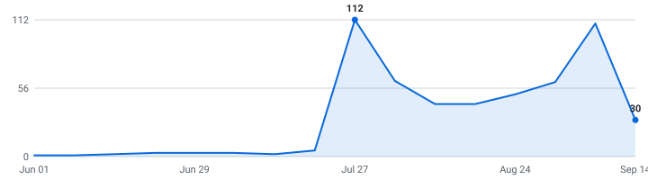

# Indian Tech Internships

   

A self-updating engine that tracks tech internships so you don't have to. Instead of refreshing a dozen career pages by hand, it reads company hiring feeds directly and keeps one live list, newest roles on top, refreshed automatically throughout the day.

**0 open roles · 87 new this week · 4,997 companies tracked · updated Sep 11, 2026 at 22:28 UTC**

**⭐Star this repo⭐** to save it and get updates when new roles are added.

**Live:** [dashboard](https://aditya-s45.github.io/placement-interns/) · [RSS feed](https://aditya-s45.github.io/placement-interns/feed.xml) (instant alerts in any RSS app) · [JSON API](https://aditya-s45.github.io/placement-interns/api/jobs.json)

**🔔 New roles in your inbox:** [subscribe by email](https://aditya-s45.github.io/placement-interns/#subscribe) - one email a day, only when new internships actually appeared, one-click unsubscribe. (Prefer RSS-to-email? [Feedrabbit works too](https://feedrabbit.com/subscriptions/new?url=https%3A%2F%2Fraw.githubusercontent.com%2Faditya-s45%2Fplacement-interns%2Fmain%2Fdocs%2Ffeed.xml).)
---

_No matching roles right now, the list fills as companies post. Star it and check back._

## What this is

This is an engine, not a hand-kept list. It polls company career feeds several times a day, finds the internships, removes duplicates, and rebuilds this page on its own. Every link comes straight from the source, so it's real and current, not a stale list someone forgot to update (speed matters).

## What makes this different

- **📅 [Drop Radar](#drop-radar)** - the only list that shows **what's coming**: each marquee company's typical opening window, then confirmed with the real drop date the moment the engine catches it live.
- **Real posted dates on every role** - pulled from each job portal itself, so newest-first actually means newest.
- **Skill tags + pay, extracted** - every posting's text is scanned for the stack it wants (Python, C++, PyTorch, ...) and the pay it states - searchable on the [dashboard](https://aditya-s45.github.io/placement-interns/), included in the CSV and API.
- **Alerts your way** - [email digests](https://aditya-s45.github.io/placement-interns/#subscribe), [RSS](https://aditya-s45.github.io/placement-interns/feed.xml), or Discord - plus a [live dashboard](https://aditya-s45.github.io/placement-interns/) with search and custom filters.
- **An engine, not a spreadsheet** - polled every hour across multiple ATS platforms with full source in this repo.

## Scope

- **Roles:** Software Engineering, Data Science & Machine Learning (and closely related technical internships)
- **Region:** India
- **Cycles:** Summer 2027 and Fall 2026

## About

I built this engine to automate tracking for top-tier tech internships across India and globally remote roles. Use it to spot roles early and apply before they fill up - being first genuinely helps.

## How to use

- Roles are grouped by cycle - **newest posting on top, oldest at the bottom.**
- The **Posted** column is the date the company published the role.
- **Flags:** 🆕 = spotted in the last 48 hours.
- Track your applications with [`data/internships.csv`](data/internships.csv) (opens in Excel / Google Sheets).
- Missing a company? Adding one takes a single line, see [CONTRIBUTING.md](CONTRIBUTING.md).

---

## 📅 Drop Radar — when companies usually post for Summer 2027

Stop refreshing career pages. Every date here is **real or verified** — no third-party list. 🎯 = the engine **saw the drop itself** from the company's own careers API; the rest are hand-checked typical opening windows for marquee names. ✅ = already live in the list above.

> **Heads up:** companies trend *earlier* every cycle, and "~Aug" is a month, not a day. Treat "expected" as when to **start watching**, and "rolling" companies as worth checking year-round.

| Company | Typical opening | Expected this cycle | Status |
|---|---|---|---|
| Citadel | ~Aug | ~Aug · any day now | ⏳ waiting |
| Citadel Securities | ~Aug | ~Aug · any day now | ⏳ waiting |
| Databricks | ~Aug | ~Aug · any day now | ⏳ waiting |
| DoorDash | ~Aug | ~Aug · any day now | ⏳ waiting |
| DRW | ~Aug | ~Aug · any day now | ⏳ waiting |
| Google | ~Aug | ~Aug · any day now | ⏳ waiting |
| Jane Street | ~Aug | ~Aug · any day now | ⏳ waiting |
| Meta | ~Aug | ~Aug · any day now | ⏳ waiting |
| Optiver | ~Aug | ~Aug · any day now | ⏳ waiting |
| Pinterest | ~Aug | ~Aug · any day now | ⏳ waiting |
| Salesforce | ~Aug | ~Aug · any day now | ⏳ waiting |
| SIG | ~Aug | ~Aug · any day now | ⏳ waiting |
| Snowflake | ~Aug | ~Aug · any day now | ⏳ waiting |
| Uber | ~Aug | ~Aug · any day now | ⏳ waiting |
| Adobe | ~Sep | ~Sep · any day now | ⏳ waiting |
| Airbnb | ~Sep | ~Sep · any day now | ⏳ waiting |
| Bloomberg | ~Sep | ~Sep · any day now | ⏳ waiting |
| Plaid | ~Sep | ~Sep · any day now | ⏳ waiting |
| Point72 | ~Sep | ~Sep · any day now | ⏳ waiting |
| Robinhood | ~Sep | ~Sep · any day now | ⏳ waiting |
| Roblox | ~Sep | ~Sep · any day now | ⏳ waiting |
| Stripe | ~Sep | ~Sep · any day now | ⏳ waiting |
| D.E. Shaw | ~Oct | ~Oct · in ~20d | ⏳ waiting |
| Coinbase | ~Dec | ~Dec | ⏳ waiting |
| Ramp | ~Dec | ~Dec | ⏳ waiting |
| Two Sigma | ~Dec | ~Dec | ⏳ waiting |
| Apple | rolling | year-round | ⏳ waiting |
| Datadog | rolling | year-round | ⏳ waiting |
| Jump Trading | rolling | year-round | ⏳ waiting |
| Microsoft | rolling | year-round | ⏳ waiting |

_72 companies on the [full radar](https://aditya-s45.github.io/placement-interns/#radar). **38** dated from our own live observations 🎯 (this grows every cycle). "~Aug" = hand-verified typical month, not a promise of the day; "rolling" = posts year-round; "waiting" = not seen in our tracked feeds yet, not a guarantee it isn't out somewhere else._

<strong>Recently closed</strong> — 40 roles taken down in the last 14 days

| Company | Role | Cycle | Closed |
|---|---|---|---|
| Arista Networks | Intern Software Engineers - C/C++ | Summer 2027 | 2026-09-11 |
| GE Healthcare | Surgery Field Engineer Apprentice (Chattanooga, TN) | Summer 2027 | 2026-09-11 |
| F5 | Software Engineer Apprentice | Summer 2027 | 2026-09-11 |
| GE Healthcare | Intern Firmware | Summer 2027 | 2026-09-11 |
| Liberty University | Quality Analyst Engineer Apprentice | Summer 2027 | 2026-09-11 |
| Novartis | Intern Data Science | Summer 2027 | 2026-09-11 |
| Valeo | R&D Trainee/Apprentice/VIE | Summer 2027 | 2026-09-11 |
| State Street | Apprentice | Summer 2027 | 2026-09-11 |
| Deutsche Bank | Apprentice Hiring for 2026- 2027 | Summer 2027 | 2026-09-11 |
| Cushman & Wakefield | EIC Apprentice - Valuations and Advisory_Ahmedabad | Summer 2027 | 2026-09-11 |
| Cushman & Wakefield | EIC Apprentice- Project & Development Services | Summer 2027 | 2026-09-11 |
| Cushman & Wakefield | EIC Apprentice | Summer 2027 | 2026-09-11 |
| Acumatica | AI & Automation Intern, Office of the CFO | Summer 2027 | 2026-09-10 |
| LinkedIn | Software Engineering Intern | Summer 2027 | 2026-09-10 |
| ABB | ITI apprentice | Summer 2027 | 2026-09-10 |
| Acxiom | Intern - Data Scientist | Summer 2027 | 2026-09-10 |
| Cleveland-Cliffs | Information Technology Intern | Summer 2027 | 2026-09-10 |
| Allegion | Summer Intern – Firmware Engineer (Advanced Development) – Indianapolis, IN | Summer 2027 | 2026-09-10 |
| Allegion | Summer Intern - Firmware Engineer | Summer 2027 | 2026-09-10 |
| Allstate Insurance Company | Pricing Actuarial Analyst Intern | Summer 2027 | 2026-09-10 |
| Astreya | AI Infrastructure DC Design Intern | Summer 2027 | 2026-09-10 |
| CACI | Business/Systems Analyst Intern - Summer 2027 | Summer 2027 | 2026-09-10 |
| Cambium Learning Group | Software Engineer Intern – AI Applications | Summer 2027 | 2026-09-10 |
| Campbellsoup | Agentic AI Engineer Co-Op | Summer 2027 | 2026-09-10 |
| Campbellsoup | Business Analyst (Co-op), DA&AI | Summer 2027 | 2026-09-10 |
| Cengage Group | Finance Apprentice | Summer 2027 | 2026-09-10 |
| Citi | Young Apprentice - C00 - PUNE | Summer 2027 | 2026-09-10 |
| Corteva | Business Analyst Intern | Summer 2027 | 2026-09-10 |
| Corteva | R&D Internship – Computer & Data Science | Summer 2027 | 2026-09-10 |
| Cox | Inspector Apprentice (Manheim) | Summer 2027 | 2026-09-10 |
| Deutsche Bank | HR Apprentice | Summer 2027 | 2026-09-10 |
| Deutsche Bank | Apprentice Hiring for 2026- 2027 | Summer 2027 | 2026-09-10 |
| Deutsche Bank | Apprentice Role for Non-Technology hiring, NCT | Summer 2027 | 2026-09-10 |
| Elanco | Junior IT Engineer – Information Technology Intern (Summer 2027) | Summer 2027 | 2026-09-10 |
| Ensemble Health Partners | Data Scientist Intern | Summer 2027 | 2026-09-10 |
| Equifax | Trainee -Data Operations Analyst | Summer 2027 | 2026-09-10 |
| F5 | Software Engineer Apprentice | Summer 2027 | 2026-09-10 |
| GE Aerospace | Data Science Intern | Summer 2027 | 2026-09-10 |
| GE Healthcare | Research Intern - AI | Summer 2027 | 2026-09-10 |
| GE Healthcare | Client Service Technician Apprentice | Summer 2027 | 2026-09-10 |

---

## Hiring timeline

Internships posted per week, from each role's real published date - redrawn automatically on every run. When this line takes off, recruiting season is open:

<picture>
  <source media="(prefers-color-scheme: dark)" srcset="docs/trends-dark.svg">
  
</picture>

## How it stays current

A small Python engine reads public company hiring feeds directly, keeps the roles that match the scope above, de-duplicates across sources, records each role's published date once (so it never shifts), and regenerates this page through GitHub Actions. It polls every company concurrently (async) with retry/backoff and per-host rate limits. The full source is in this repo.

_Engine (last run): 4,998 companies across 25 ATS platforms · 95% fetch success · completed in 324.2s._

## Platforms Scraped

The engine currently extracts live data from the following platforms:
- **Direct ATS (Applicant Tracking Systems):** Greenhouse, Lever, Ashby, SmartRecruiters, Workable
- **Aggregators:** Instahyre

## Contributing

Adding a company takes one line, see [CONTRIBUTING.md](CONTRIBUTING.md). Suggestions and pull requests are welcome.

## Note on dates

The **Posted** column shows when a role was published, with the newest at the top. I pull the posting date straight from each job portal, but a lot of them don't expose one publicly, so those rows show a dash (—) for now instead of a guessed date. The ones that do publish a date are dated. Know the real date for a dashed role? Open a PR and I'll merge it.

Roles can close at any time, so always confirm on the company's own site before applying.
